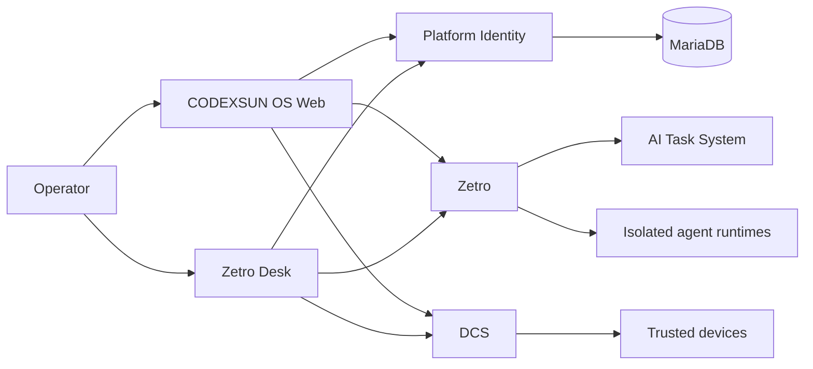

# CODEXSUN OS Architecture

## Purpose

CODEXSUN OS is the host for independent applications and add-ons. It owns shared identity, application registration, persistence infrastructure, desktop host adapters, and operations.

Zetro is an add-on. Zetro plans and coordinates agent work. It does not belong to the platform kernel.

## System map

## Ownership

Each module owns its routes, persistence, UI, and operations. Modules communicate through public contracts or durable events. Applications do not query another module’s tables.

## Deployment

The VPS runs the public web application, Platform API, Chat, Zetro, DCS, File Browser, and ZXA as separate services. Cloudflare Tunnel forwards `os.codexsun.com` to the web service.
