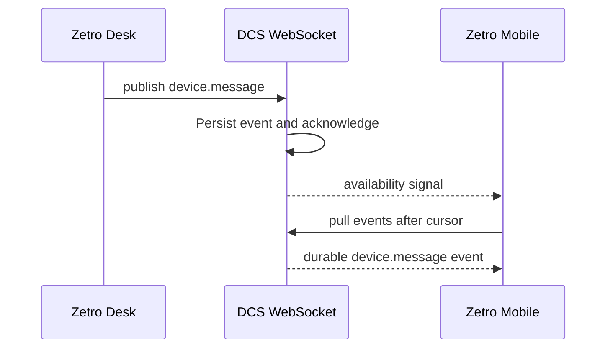

# DCS and Device Chat

DCS means Device Communication Service. It transports durable, scoped events between trusted devices. It is separate from Chat.

## Device enrollment

An authenticated operator enrolls a device. DCS returns a device token once. The device stores the token locally. DCS stores only its SHA-256 hash.

## Device Chat

Device Chat publishes a `device.message` event through DCS. Each message has a sender device, target device, body, and time. Devices in the scope receive the event stream and show only messages addressed to them or sent by them.

DCS does not execute a received message. Each application decides how to validate and apply its own event types.
