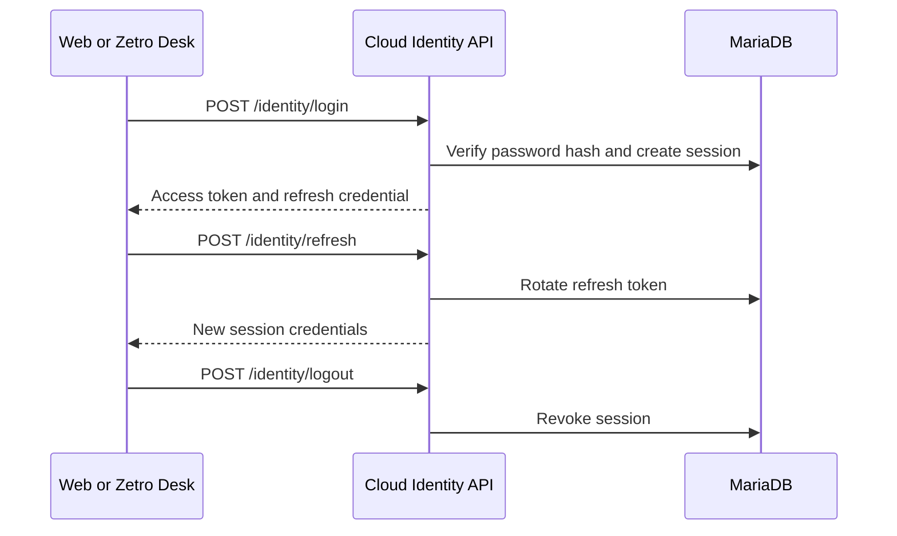

# Identity and Sessions

## Credential flow

The VPS gets an initial administrator bootstrap value from private deployment configuration. It uses that value only to create the first identity account.

After first setup, MariaDB stores a salted password hash. The system does not store the chosen user password as plaintext in an environment file.

## Client storage

Web uses a secure HTTP-only refresh cookie on the same public origin. Zetro Desk stores the refresh credential in the Windows credential vault. Access tokens stay in memory and expire after 15 minutes.

## Sign out

Sign out revokes the server session. It also clears the browser cookie or desktop credential vault entry. A stale browser access token can still revoke through its refresh cookie.
