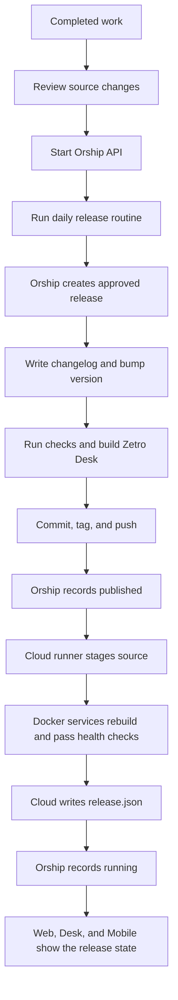
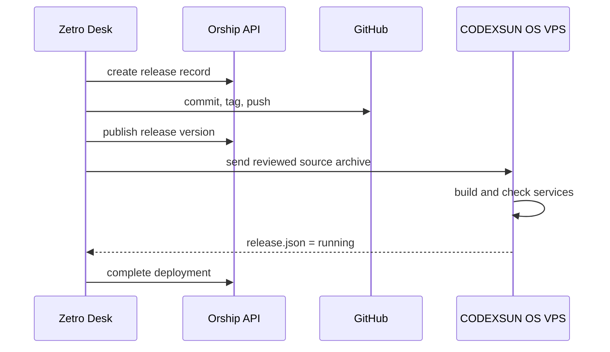

# Run Orship Releases

Orship records the release lifecycle. It does not run Git, Docker, or cloud commands itself. The reviewed desktop release routine runs those commands and writes each result back to Orship.

## First release: enter these values

Use the **Desktop release intent** form only to record a planned release. It does not deploy the cloud release.


1. In the first field, type `codexsun-os`.
2. In the second field, type a short release title. For example, `Show installed release version in context dock`.
3. Click **Create release record** to record the intent and view it in the Release console.
4. If the console shows `Failed to fetch`, start the local Orship API and click **Refresh**.

```powershell
npm.cmd run dev -w @codexsun/orship-api
```

For a real cloud deployment, do not create the form record first. The release routine creates the authoritative Orship record so it has one complete lifecycle.

## First cloud deployment: type this command

Open PowerShell at `E:\Workspace\codexsun\codexsun`. Replace the text after `-Title` with what you completed.

```powershell
npm.cmd run release:daily -- -Title "Show installed release version in context dock"
```

Wait for the command to finish. It writes the changelog, updates the version, builds Zetro Desk, commits, tags, pushes, and deploys the cloud release.

When the command finishes, click **Refresh** in Orship. A green result shows the new version with the `running` state.

## Release flow



## Helper: start Orship

Open PowerShell at the CODEXSUN OS repository root.

```powershell
npm.cmd run dev -w @codexsun/orship-api
```

Orship listens at `http://127.0.0.1:4190`.

Open CODEXSUN OS, choose **Orship** from the app launcher, and use the console to view release events and cloud state.

## Helper: run a normal release

First, review the changes. Keep unrelated work out of the release.

```powershell
git status --short
git diff --check
```

Then run the reviewed release routine.

```powershell
npm.cmd run release:daily -- -Title "Describe the completed work"
```

The routine performs these steps in order.

1. Create an Orship release record.
2. Write the changelog and increase the lockstep version.
3. Run repository checks.
4. Build the Zetro Desk installer.
5. Commit, tag, and push the release.
6. Mark the source as published in Orship.
7. Deploy the cloud source archive and wait for Docker health checks.
8. Mark the operation as `running` when the cloud state is green.

## Check the result

```powershell
npm.cmd run release:status
powershell -ExecutionPolicy Bypass -File deploy/watch-vps-release.ps1
```

A successful release shows the expected version with phase `running` in Orship and in `/home/codexsun-os/deploy/state/release.json`.



## When a release stops

| State | What to do |
| --- | --- |
| Local check fails | Fix the problem. Start a new release after review. |
| Desktop build fails | Fix the desktop build before committing. |
| Cloud reports `failed` | Read the deployment log, review the cause, then start a new release. |
| Device notice is pending | The cloud release can still run. Enroll a trusted desktop and set `OS_RELEASE_DEVICE_TOKEN` for later notifications. |

Do not retry by manually changing an Orship state. Start a new reviewed release after the issue is fixed.
