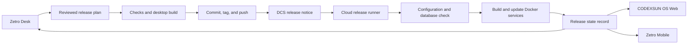

# Release Task System

The Release Task System is the daily release record for CODEXSUN OS. It gives Zetro Desk, CODEXSUN OS Web, and Zetro Mobile one view of source, deployment, and device status.

It does not let clients deploy services. The reviewed release routine is the only deployment path.



## Ownership and boundaries

| Component | Owner | Responsibility |
| --- | --- | --- |
| Release plan and evidence | AI Task System | Tracks review, approval, checks, and release evidence. |
| Local release execution | Zetro Desk | Starts the approved routine from the trusted development workstation. |
| Device event transport | DCS | Sends durable release events to enrolled devices. |
| Cloud release execution | `deploy/apply-vps.sh` | Stages source, preserves runtime data, builds containers, waits for health, and records state. |
| Release state display | Web, Desk, Mobile | Reads the cloud state and DCS events. It never deploys services. |

The VPS receives a source archive from the tagged local commit. It does not use `git pull`. This prevents an unrelated remote branch change from entering a release.

Orship is the reusable domain module for this process. It owns release records and lifecycle transitions. AI Task System, Zetro, DCS, and each project integrate only through its public contracts and event ports.

## Release state contract

The cloud runner writes `/home/codexsun-os/deploy/state/release.json`.

```json
{
  "version": "0.1.24",
  "phase": "running",
  "updatedAt": "2026-09-06T05:26:18Z",
  "run": "20260906T052357Z"
}
```

| Phase | Meaning | Client behavior |
| --- | --- | --- |
| `planned` | The source archive passed validation. | Show that a release was received. |
| `validated` | Cloud configuration and schema bootstrap passed. | Show validation progress. |
| `building` | Docker images are building. | Show deployment in progress. |
| `running` | All required service health checks passed. | Mark the release successful. |
| `failed` | The runner stopped. | Show the deployment log path and require operator review. |

## Daily release procedure

Before a release, review the changed work in Zetro Desk and record the outcome in the AI Task System.

1. Verify the intended branch and working tree.
2. Run the release with a short title.

```powershell
npm.cmd run release:daily -- -Title "Describe the release"
```

3. Add `-DatabaseUpdate` only when a migration changes persisted data.
4. Watch the cloud result.

```powershell
npm.cmd run release:status
powershell -ExecutionPolicy Bypass -File deploy/watch-vps-release.ps1 -Watch
```

The routine runs `git diff --check`, creates the changelog and version, runs repository checks, builds Zetro Desk, commits, tags, pushes, publishes the source archive, deploys it, and reads the cloud state.

Use `-SkipDesktop` only for an approved web-only hotfix. Use `-SkipDeviceNotification` only when DCS is unavailable and the release record states that device notification is pending.

## Device notification

DCS sends `codexsun.release` events after source publication and after the cloud reaches `running`.

1. Enroll the desktop device through CODEXSUN OS identity.
2. Store its device token in the private local `.env` file.

```text
OS_RELEASE_DEVICE_TOKEN=<enrolled-device-token>
```

3. Run the release routine again for the next release.

The token never goes into Git, release logs, prompts, or the cloud source archive. If no token exists, deployment continues and the script reports a pending notification. It does not claim that a device received the event.

## Failure and recovery

| Situation | Action |
| --- | --- |
| Local checks fail | Fix the issue. Start a new release only after review. |
| Desktop build fails | Keep the source uncommitted. Fix the desktop build, then restart the routine. |
| Push fails | Resolve the Git error. Do not tag a different commit under the same version. |
| Cloud release fails | Read the run log in `/home/codexsun-os/.deploy-runs/<run>/deploy.log`. Review the recorded `failed` state before retrying. |
| DCS is unavailable | Complete the cloud deployment only if approved. Record that device notification is pending. |
| Database migration fails | Stop. Restore from the database backup process before attempting another release. |

The cloud runner keeps runtime configuration, database data, file storage, and earlier images outside the source archive. It updates containers only after the staged source and Docker configuration pass validation.

## Verification evidence

A release is complete only when all of these are true.

1. `npm.cmd run check` passes locally.
2. The desktop installer build completes when the desktop changed.
3. The commit and `v-<version>` tag exist on `origin/main`.
4. `release.json` reports the expected version and `running`.
5. Docker reports required services as healthy.
6. `https://os.codexsun.com/health` returns HTTP 200.
7. Desktop identity CORS preflight returns HTTP 204 with the trusted origin and credentials header.

## Delivery roadmap

The current release runner and watcher are complete. These client features follow the same state contract.

1. Add an AI Task System release workspace with approval, evidence, and state history.
2. Store the DCS token and event cursor in desktop secure storage.
3. Add the Zetro Mobile release status view with DCS replay.
4. Add an authenticated platform API that exposes the release-state record.
5. Add a scheduled cloud watcher that emits a failure event after a deployment timeout.
## Orship visual console

Orship is the release record for the desktop and cloud handoff. Use the Orship shortcut from the app menu on desktop or web.

The desktop release routine creates an approved operation before it writes the changelog. It then records source publication, starts cloud deployment, and records the running result. The cloud runner writes its own applied release state. The console shows both records. It does not run Git, Docker, or cloud commands from the browser.

Run the routine with Orship running:

```powershell
npm.cmd run dev
npm.cmd run release:daily -- -Title "Describe the completed work"
```

Use `-SkipOrship` only when the local release service is unavailable and record the missed release later.
