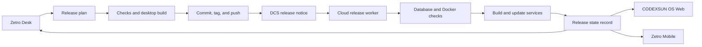

# Release Task System

The Release Task System records each daily CODEXSUN OS release. It separates planning, approval, deployment, and device notification.

## Responsibilities

- Zetro Desk starts a reviewed release run and shows local evidence.
- The release routine creates the changelog entry, validates source, builds the desktop package, commits, tags, pushes, and deploys.
- DCS transports a durable `codexsun.release` event only from an enrolled device token.
- The cloud worker validates deployment configuration, preserves database state, builds Docker images, waits for health checks, and writes `release.json`.
- Web, desktop, and mobile read the release state and DCS events. They do not deploy services.

## Daily operation

Use `npm.cmd run release:daily -- -Title "Short release title"` after review. Add `-DatabaseUpdate` only when a migration changes persisted data. The routine stops on a failed check, build, Git action, or cloud deployment.

Set `OS_RELEASE_DEVICE_TOKEN` in the local private `.env` after enrolling the desktop in DCS. Without it, deployment still completes and the routine records that device notification is pending.

## Next delivery stages

1. Add a release workspace to the AI Task System with approval, evidence, and release-state views.
2. Add desktop secure storage for the release device token and DCS cursor.
3. Add the Expo mobile release-status view and DCS replay worker.
4. Add a cloud API that exposes the release-state record to authenticated clients.
