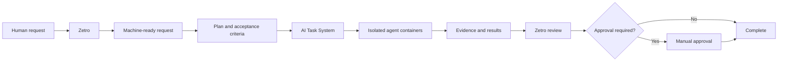

# Zetro and Tasks

Zetro accepts a human request, writes a machine-ready plan, chooses approved agents, and collects evidence. The AI Task System owns task state, acceptance criteria, approvals, and result history.

Agent runtimes can propose changes. They cannot change rules, prompts, learned guidance, or code without review.

## Agent Crew boundary

Zetro is the standalone agent experience. Agent Crew runs one authenticated specialist runtime per Docker container. The Platform only registers and composes these applications.

Each runtime owns its reviewed duties, skills, memory, conversations, provider configuration, backup, and restore data. It cannot access the host checkout, Docker socket, or another runtime’s data.
